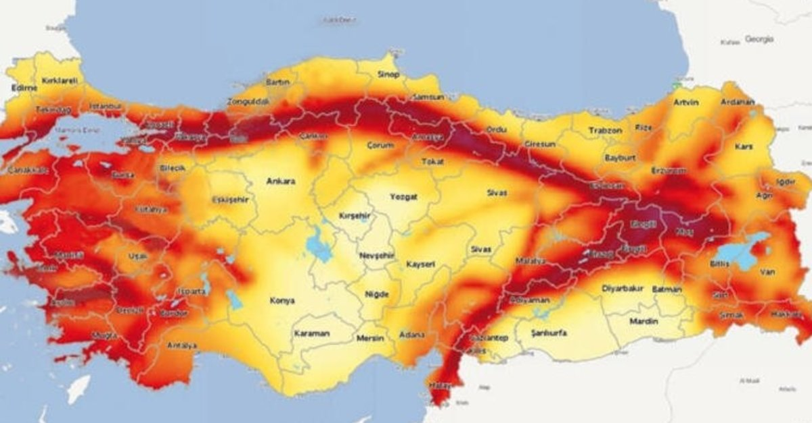

# Turkey Earthquakes (1915-2023)
Bu çalışma, kaggle’dan alınan Turkey Earthquakes (1915-2023)(*) adlı, 1915-2023 arası Türkiye depremlerini ve özelliklerini içeren veri seti ile hazırlanmıştır.

(*) https://www.kaggle.com/datasets/atasaygin/turkey-earthquakes-1915-2023 

 

Veri seti Türkiye’de ve yakın kapsama alanında meydana gelen depremleri içermektedir. Bu veriler 1915’ten Ocak 2023’e kadar olan aralıkta ve 3.5 büyüklüğünden fazla olan depremleri içermektedir.

 Analiz kapsamında Yıllara Göre Haritalama, Kabarcık Çizimi Grafiği, Korelasyon Haritası, Zaman Serisi Grafiği ve Derinlik Haritası incelenmiştir.

---

## Veri Seti Değişkenleri

| Değişken | Anlamı |
|--|--|
| No | İndex |
| Deprem.Kodu | Deprem kodu |
| Olus.tarihi | Gerçekleştiği tarih |
| Olus.zamani | Gerçekleştiği saat:dakika:saniye:salise |
| Enlem | Gerçekleştiği enlem |
| Boylam | Gerçekleştiği boylam |
| Derinlik | Derinliği |
| xM | Verilen büyüklük değerleri (MD, ML, Mw, Ms, Mb) arasındaki en büyük değer |
| MD | Süreye bağlı büyüklük |
| ML | Yerel (Lokal) büyüklük |
| Mw | Moment büyüklüğü |
| Ms | Yüzey dalgası büyüklüğü |
| Mb | Cisim dalgası büyüklüğü |
| Tip | Deprem tipi |
| Yer | Gerçekleştiği yer |

